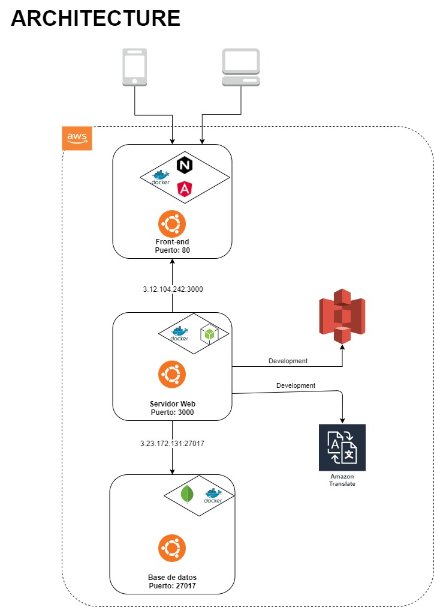

# Arquitectura

## Diagrama

## Stack MEAN

### Que es MEAN?
MEAN es desarrollo full-stack en JavaScript, es decir, es el conjunto de tecnologías necesarias para el desarrollo de todas las capas de una aplicación web con JavaScript. Está compuesto por cuatro de las más importantes tecnologías de la industria: MongoDB, Express, Angular y Node.js.

#### MongoDB

MongoDB es una base de datos orientada a documentos y de esquema libre que proporciona alta capacidad de almacenamiento, velocidad en las consultas, además de ser fácilmente escalable.

#### Express
Express es un web application framework para Node.js, es decir es un framework para hacer aplicaciones web. Es minimalista, rápido y fácil de usar y es la mejor opción cuando estás trabajando con Node para el lado del servidor, porque se adapta muy bien a su filosofía.

#### NodeJs
Node.js es un runtime, es decir es un programa que corre JS, construido sobre el motor de JavaScript que usa Chrome. Node es el entorno de desarrollo de la capa del servidor, te permite desarrollar rápidamente aplicaciones escalables a nivel del servidor.

#### Angular
Angular es un framework para aplicaciones web desarrollado en TypeScript, de código abierto, mantenido por Google, que se utiliza para crear y mantener aplicaciones web de una sola página.

**Nota:** Teoricamente MEAN involucra el utilizar Javascript, incluyendo AngularJS, para este caso se utiliza Agunar8, el cual ya es un framework en Typescript, igualmente el servidor de NodeJs se desarrolla en Typescript.

#### Por que estas tecnologias?
MongoDB es especialmente útil en entornos que requieran escalabilidad. Con sus opciones de replicación y sharding, que son muy sencillas de configurar, podemos conseguir un sistema que escale horizontalmente sin demasiados problemas. El no ser relacional no implica un problema, ya que no se necesitan transacciones en el proyecto y al ser una red social, el manejo de grandes cantidades de datos nos viene bien.

Las demas tecnologias, al ser desarrolladas en un mismo lenguaje podemos desarrollar tanto como en el backend y el fronend un mismo estandar de programacion y facilitar el desrrollo.

La implicacion de un chat nos viene de maravilla en estas tecnologias, ya que con Socket.io podemos manejar los datos en tiempo real en ambas partes con la misma libreria.
